<p align="right">
  <strong>English</strong> · <a href="README.ko.md">한국어</a>
</p>

# TokenChan (토큰쨩)

A desktop pet that turns your AI CLI's **token usage, rate limits, and activity** into an always-visible character.

TokenChan supports **Claude Code · Codex CLI · Antigravity CLI**. It reacts when a task finishes and warns you when context or rate limits are running low.

<p align="center">
  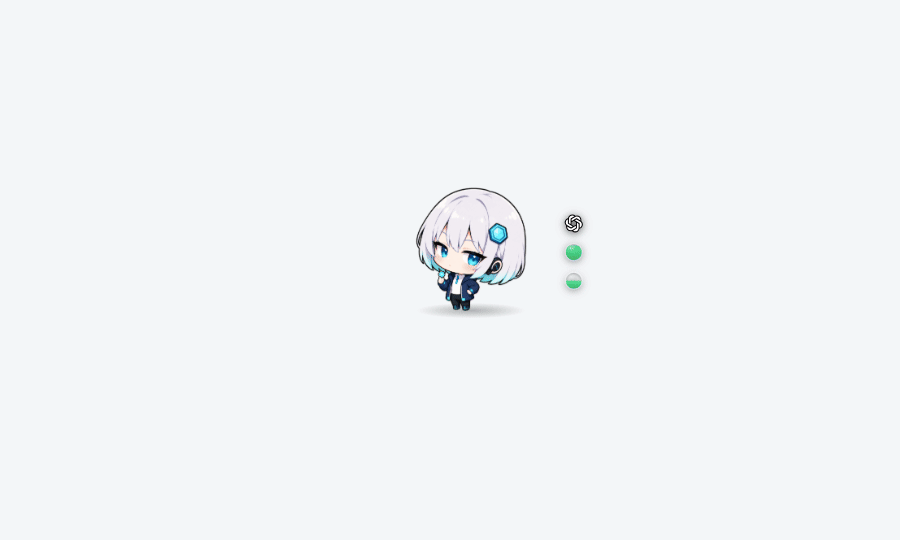
</p>

<p align="center">
  <a href="https://github.com/lzyxion/token-chan/releases"><strong>Download the latest release</strong></a>
</p>

## Features

- **Live activity detection** — See when a CLI is working and when its latest task has finished.
- **At-a-glance gauges** — Track context usage, official rate limits, and time until reset.
- **Unified usage panel** — Review today's usage, period statistics, model breakdowns, and recent sessions.
- **State-aware alerts** — Get speech-bubble notifications for completed tasks, limit warnings, exhaustion, resets, and inactivity.
- **Character customization** — Replace state images and dialogue, or assign a different character to each model.
- **Multi-account aggregation** — Choose which locally discovered CLI accounts to include in usage totals.

No TokenChan account or additional sign-in is required. TokenChan uses the records and configuration of CLI tools that are already signed in on your computer.

## Installation

Download the appropriate package from [GitHub Releases](https://github.com/lzyxion/token-chan/releases).

| Operating system | Package | Availability |
| --- | --- | --- |
| Windows | `.msi` | Prebuilt installer |
| macOS | `.dmg` | Prebuilt installer |
| Linux | Source build | No prebuilt package |

> [!WARNING]
> Release packages are currently unsigned.
> On **Windows**, choose `More info → Run anyway` in SmartScreen. On **macOS**, right-click the app and choose `Open`.

Before launching TokenChan, install and sign in to at least one supported tool: Claude Code, Codex CLI, or Antigravity CLI.

## Quick controls

| Action | Result |
| --- | --- |
| Click | Makes the character react and report current usage in a speech bubble. |
| Double-click | Opens or closes the usage panel. |
| Drag | Moves the character and remembers where it was placed. |
| Click the gauge logo | Switches between automatic selection, Claude, Codex, and Antigravity, and pins the selected provider. |
| Right-click | Opens the pet menu for visibility, usage, accounts, Character Studio, and settings. |
| Tray icon | Opens the pet menu. This is also where you disable click-through mode. |

## Character states

| State | Trigger |
| --- | --- |
| Idle | No current event |
| Working | A CLI is generating a response |
| Done | A task in a session has just finished |
| Alert | Context or an official rate limit exceeds the warning threshold — 80% by default |
| Exhausted | The current session limit reaches 100% |
| Refreshed | A new rate-limit window opens |
| Sleeping | No activity for the configured period — 30 minutes by default |
| Poked | The character is clicked |

When the state changes, TokenChan displays the corresponding character image and dialogue. It can also warn you shortly before a rate-limit reset regardless of the current state; the default lead time is 15 minutes.

## Reading the gauges

The rings next to the character show values for one selected provider. The logo at the top identifies that provider and blinks while a task is running.

| Default | On hover |
| :---: | :---: |
|  | 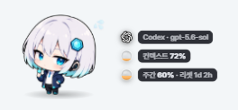 |

- In automatic mode, TokenChan selects a provider in this order: `currently working → most recently used session → highest usage today`.
- Click the logo or use `Settings → General → Gauge` to pin a provider.
- A dotted ring does not mean 0%; it means **the value is not currently available**.
- Gauge labels can appear `on hover`, `while working`, or `always`.
- While a task is running, the label reports elapsed time, such as `Claude · opus-5 · 4m 12s`.

Open the usage panel to compare all providers at once.

## Usage panel

Double-click the character or open the panel from the tray menu. Move between pages with the mouse wheel or the `◀` and `▶` buttons.

| Overview | Recent sessions | Stats & usage | Activity history |
| :---: | :---: | :---: | :---: |
| 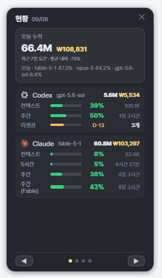 | 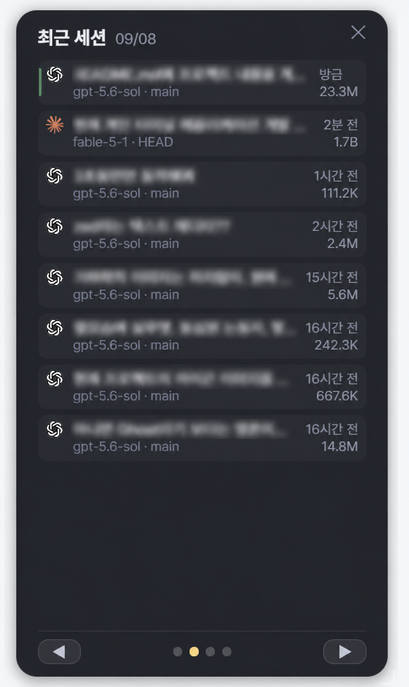 | 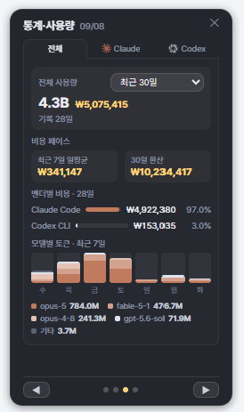 | 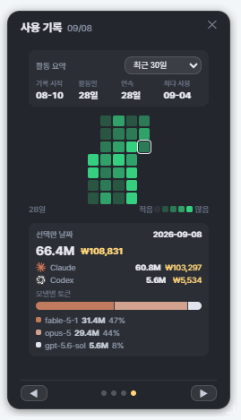 |

| Page | Contents |
| --- | --- |
| Overview | Context, official rate limits, and time until reset for each provider |
| Recent sessions | Project, session title, and token usage by session |
| Stats & usage | Usage and cost by period, daily averages, provider share, and recent model totals |
| Activity history | Activity calendar and provider/model usage for the selected day |

## Settings

| Tab | Options |
| --- | --- |
| General | Interface language (English by default, Korean available), currency and exchange rate, gauge shape, position, fill direction and labels, start hidden, launch at login |
| Alerts | Context and official-limit thresholds, reset warning lead time, completion dialogue, sleep delay |
| Character | Default character, size, speech bubble, model rules, Character Studio |
| Accounts | Discovered CLI accounts, inclusion in totals, additional CLI home directories |

| General settings | Alert settings | Character settings | Account settings |
| :---: | :---: | :---: | :---: |
| 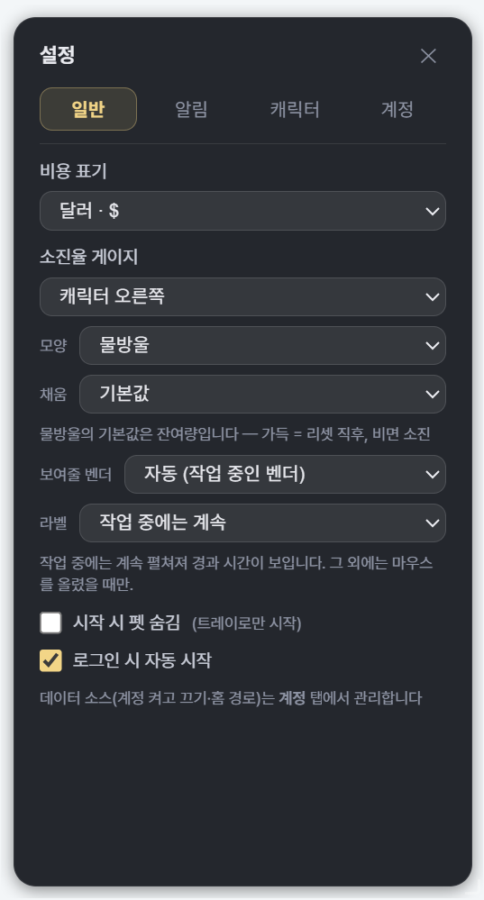 | 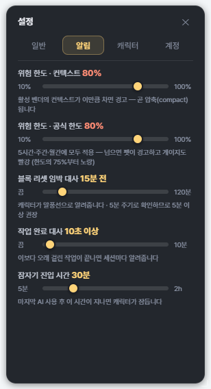 | 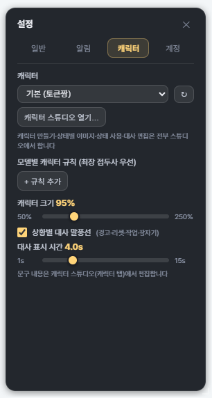 | 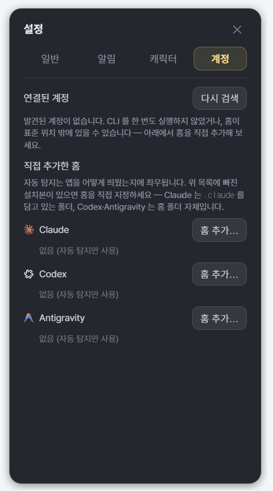 |

Settings are stored in `<OS config directory>/token-chan/settings.json`.

## Character customization

Open `Settings → Character → Open Character Studio` (`설정 → 캐릭터 → 캐릭터 스튜디오 열기`) to create a character and edit its state images and dialogue. Drop images onto state cards to import them, then use `▶ Test` to preview the result on the desktop pet.

<p align="center">
  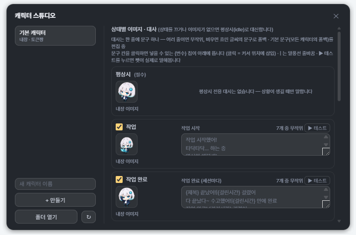
</p>

Character packs are stored in the following structure:

```text
<OS config directory>/token-chan/characters/
└─ my-cat/
   ├─ idle.gif        # Required — used when another state image is missing
   ├─ working.gif
   ├─ alert.gif
   ├─ sleep.gif
   ├─ exhausted.gif
   ├─ refreshed.gif
   ├─ done.gif
   ├─ poke.gif
   ├─ speech.json     # Optional — character dialogue
   └─ pack.json       # Optional — disabled states
```

- Supported formats: `.gif`, `.webp`, `.apng`, `.png`, `.svg`
- Maximum size: 20MB per file
- A transparent background and a longest edge of at least 512px are recommended.
- Keep every state on the same canvas and at the same scale to avoid visual jumps between states.
- Breathing, swaying, hopping, and the `z`, `!`, `🪫`, and `✨` badges are added by the app.
- Copy the entire character directory to share its images, dialogue, and state configuration.

### Writing dialogue

Dialogue is stored in the character pack's `speech.json` file.

```json
{
  "enter.working": ["Let's code!|You've got this", "Time to work~"],
  "poke": ["You've used {todayTokens} today"]
}
```

- When an event has multiple lines, TokenChan chooses one at random.
- `|` inserts a line break inside the speech bubble.
- Variables such as `{todayTokens}`, `{session}`, `{context}`, `{resetIn}`, `{model}`, and `{provider}` are replaced with their current values. Korean variable names remain supported for existing dialogue files.
- A line is skipped when it contains a variable whose value is unavailable.

### Model-specific characters

Use `Settings → Character → Model-specific character rules` to map model prefixes to characters.

For example, `claude` matches every Claude model, while `claude-opus` matches only Opus models. When multiple rules match, the longest prefix wins.

## Data and privacy

- Token and session statistics are calculated from CLI session records stored on your computer.
- Conversation content and usage statistics are not uploaded to a TokenChan server.
- To refresh official Claude and Codex rate limits, TokenChan makes read-only requests to each provider's usage API.
- Those requests use authentication already stored locally by the corresponding CLI.
- TokenChan has no account system, remote database, or analytics telemetry.
- User settings and custom characters remain in your operating system's configuration directory.

Changes to CLI record formats or usage APIs may temporarily prevent some values from appearing. Antigravity CLI does not expose official rate-limit information, so TokenChan only displays values available from its local records.

## Building from source

Prerequisites:

- Node.js 22
- pnpm
- Rust stable
- Tauri system libraries on Linux

```sh
pnpm install
pnpm tauri dev      # Run in development mode
pnpm tauri build    # Build installable packages
```

On Ubuntu-based distributions, install the system libraries first:

```sh
sudo apt-get install -y \
  libwebkit2gtk-4.1-dev libxdo-dev libssl-dev \
  libayatana-appindicator3-dev librsvg2-dev
```

The frontend is built with React and TypeScript, the desktop application uses Tauri 2, and usage parsing and aggregation are implemented in Rust.

## License

[MIT License](LICENSE)
