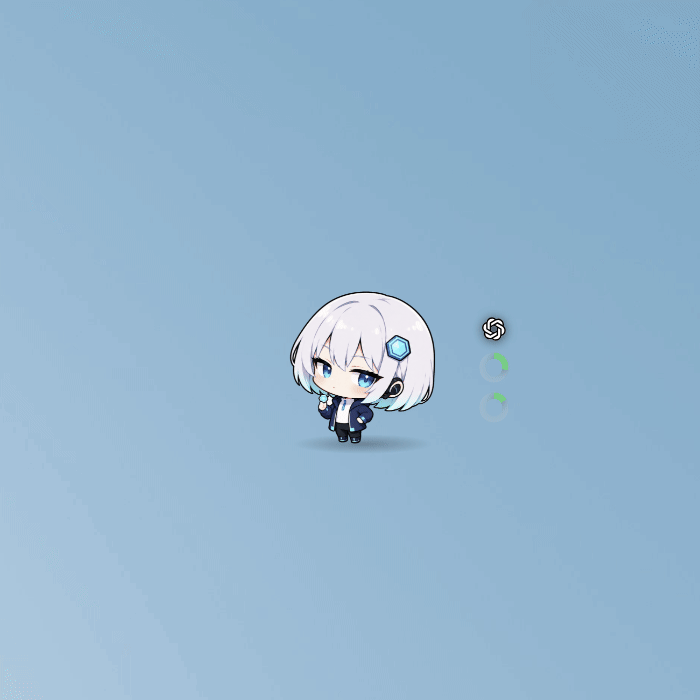
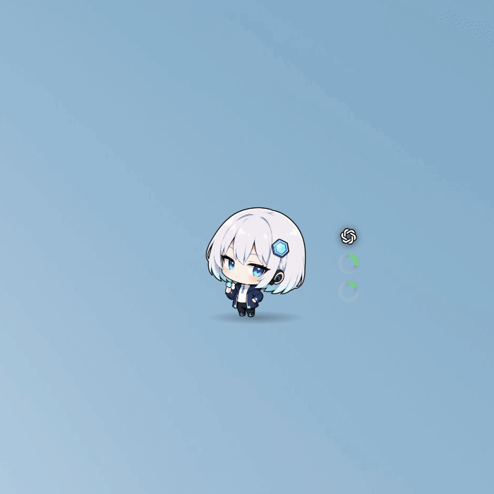
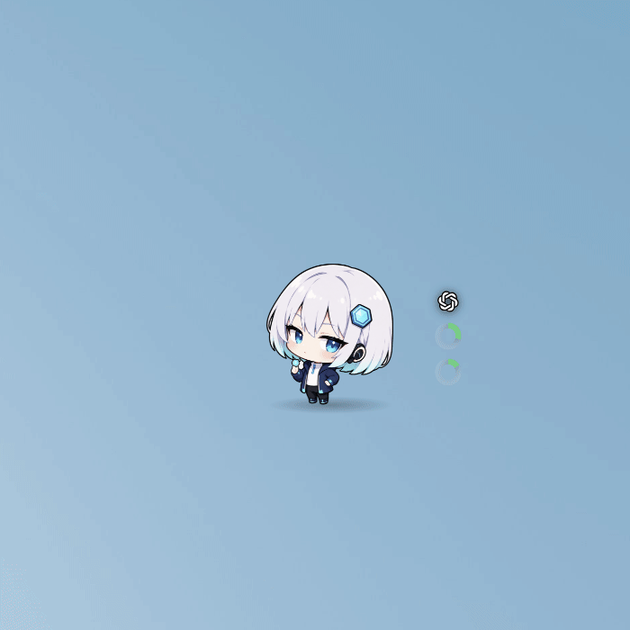
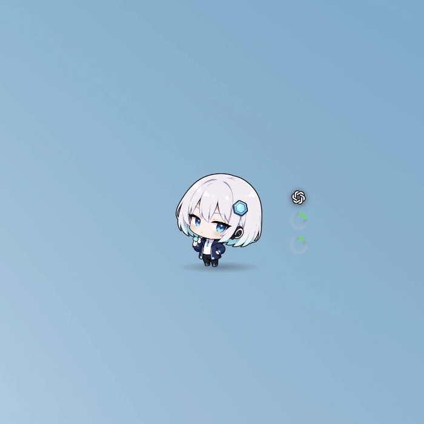

# 토큰쨩 (TokenChan)

AI CLI 의 토큰 사용량을 **바탕화면 위 데스크톱 펫**으로 보여주는 Tauri 2 앱.
**Claude Code · Codex CLI · Antigravity CLI** 를 지원합니다.

캐릭터가 바탕화면에 떠 있다가, 한도가 차거나 작업이 끝나면 말풍선으로 알려줍니다.
로그인 같은 건 필요 없습니다 — 이미 깔려 있는 CLI 의 기록을 읽습니다.

## 이렇게 씁니다

| 동작 | 미리보기 | 결과 |
| --- | --- | --- |
| **클릭 · 드래그** |  | 클릭하면 현재 사용량을 말풍선으로 알려주고, 드래그하면 펫을 원하는 위치로 옮기며 놓은 자리를 기억합니다. |
| **더블클릭** |  | 사용량 패널을 열고 벤더별 사용량을 확인할 수 있습니다. |
| **게이지 로고 클릭** |  | 게이지에 표시할 벤더를 전환하거나 고정합니다. |
| **우클릭** |  | 숨기기·패널·계정·스튜디오·설정 메뉴를 엽니다. |

## 설치

[Releases](https://github.com/lzyxion/token-chan/releases) 에서 받습니다 — Windows `.msi`, macOS `.dmg`.

> 코드 서명이 없어서 첫 실행에 OS 경고가 뜹니다.
> **Windows**: SmartScreen → 추가 정보 → 실행 · **macOS**: 우클릭 → 열기

## 조작


| 동작        | 결과                                          |
| --------- | ------------------------------------------- |
| 드래그       | 펫 이동 (놓은 자리를 기억)                            |
| 클릭        | 폴짝 뛰며 지금 사용량을 말풍선으로                         |
| 더블클릭      | 사용량 패널 열기/닫기                                |
| 우클릭       | 펫 메뉴 (숨기기 · 패널 · 계정 · 스튜디오 · 설정)            |
| 게이지 로고 클릭 | 볼 벤더 전환 (자동 → Claude → Codex → Antigravity) |
| 트레이 아이콘   | 위와 같은 메뉴. **클릭 통과 모드**를 끄는 유일한 출구           |


## 캐릭터가 알려주는 것


| 상태    | 언제                                |
| ----- | --------------------------------- |
| 평상시   | 아무 일도 없을 때                        |
| 작업    | CLI 가 지금 돌고 있을 때                  |
| 작업 완료 | 세션 하나가 막 끝났을 때 (세션마다)             |
| 경고    | 공식 한도나 컨텍스트가 위험 한도(기본 80%)를 넘었을 때 |
| 소진    | 세션 한도 100%                        |
| 초기화   | 한도 블록이 새로 열렸을 때                   |
| 잠     | 30분 동안 아무 활동이 없을 때                |
| 클릭    | 펫을 클릭했을 때                         |


상태가 바뀌면 대사도 같이 나옵니다. 리셋이 임박하면(기본 15분 전) 상태와 무관하게 한마디 합니다.

## 게이지

캐릭터 옆 링 3개는 **벤더 하나**의 값입니다 — 위에서부터 컨텍스트, 공식 한도(짧은 창부터).
맨 위 로고가 지금 보고 있는 벤더고, 작업 중이면 깜빡입니다.

```
  [logo]                        [logo] Claude · fable-5 · 작업 중
   ◕      마우스를 올리면 →      ◕ 컨텍스트 16%
   ◔                             ◔ 5시간 15% · 리셋 4h 22m
   ○                             ○ 주간 26%
```

- 벤더는 `작업 중 → 마지막으로 쓴 세션 → 오늘 사용량 1위` 순으로 자동 선택됩니다. 고정하려면 로고를 클릭하거나 설정 → 게이지에서 고릅니다.
- **점선 링은 0% 가 아니라 "아직 모르는 값"** 입니다.
- 라벨을 항상 펼쳐 두려면 설정 → 게이지 라벨 상시 표시.
- 벤더끼리 비교하려면 사용량 패널을 씁니다.

## 사용량 패널

더블클릭 또는 트레이로 엽니다. 휠이나 ◀▶ 로 3페이지를 넘깁니다.


| 페이지       | 내용                                      |
| --------- | --------------------------------------- |
| **현황**    | 벤더당 카드 하나 — 컨텍스트·공식 한도·리셋까지 남은 시간       |
| **통계**    | 오늘 / 기간 합계, 일별 사용량 잔디, 최근 7일, 오늘 모델 구성비 |
| **최근 세션** | 어느 프로젝트에서 얼마나 썼는지 (제목은 그 세션의 첫 메시지)     |


## 설정


| 탭       | 항목                                                              |
| ------- | --------------------------------------------------------------- |
| **일반**  | 통화(USD/KRW·환율), 게이지 모양·위치·채움 방향, 라벨 상시 표시, 시작 시 숨김, 로그인 시 자동 시작 |
| **알림**  | 위험 한도(컨텍스트·공식), 리셋 임박 대사 시점, 작업 완료 대사, 잠자기 진입 시간                |
| **캐릭터** | 기본 캐릭터 선택, 크기(50~250%), 말풍선, 모델별 캐릭터 규칙, 캐릭터 스튜디오 열기            |
| **계정**  | 이 머신에서 찾은 CLI 계정 목록 — 계정 단위로 집계 포함 여부를 켜고 끕니다                   |


설정 파일은 `<설정폴더>/token-chan/settings.json` 입니다.

## 캐릭터 바꾸기

**설정 → 캐릭터 → 캐릭터 스튜디오 열기**. 왼쪽이 캐릭터 목록, 오른쪽이 상태별 이미지와 대사입니다.
이미지는 카드에 끌어다 놓아도 등록되고, ▶ 테스트를 누르면 펫이 그 상태로 서서 대사를 말해 봅니다.

결과는 아래 폴더에 그대로 저장되므로 폴더를 직접 만들어도 됩니다:

```
<설정폴더>/token-chan/characters/
└─ my-cat/
   ├─ idle.gif        # 필수 — 나머지는 없으면 idle 로 대체
   ├─ working.gif  alert.gif  sleep.gif  exhausted.gif
   ├─ refreshed.gif  done.gif  poke.gif
   ├─ speech.json     # 선택 — 이 캐릭터의 대사
   └─ pack.json       # 선택 — 끈 상태 목록
```

- 형식은 **`.gif` · `.webp` · `.apng` · `.png` · `.svg`** 5가지, 파일당 20MB. 같은 상태에 여러 개면 이 순서로 먼저 찾은 하나를 씁니다. 영상(mp4 등)은 안 됩니다.
- **투명 배경**, 발이 **하단 중앙**에 오게, 긴 변 512px 이상 권장. 8장을 같은 캔버스·같은 배율로 맞추면 상태가 바뀔 때 크기가 안 흔들립니다.
- 숨쉬기·흔들림·폴짝 같은 모션과 소품 배지(`z` `!` `🪫` `✨`)는 앱이 그림 위에 얹어 줍니다 — 그림에 또 그리면 겹칩니다.
- 팩 폴더를 통째로 공유하면 그림·말투·상태 구성이 함께 갑니다.

### 대사

스튜디오에서 편집하며, 캐릭터 폴더의 `speech.json` 에 저장됩니다:

```json
{
  "enter.working": ["코딩 시작!|화이팅", "일하러 가자~"],
  "poke": ["오늘 {오늘토큰} 썼어"]
}
```

- 한 상황에 여러 줄을 넣으면 그중 하나가 무작위로 나옵니다.
- `|` 는 말풍선 안 줄바꿈, `{변수}` 는 표시 시점 값으로 바뀝니다 (`{오늘토큰}` `{세션}` `{컨텍스트}` `{리셋}` `{모델}` `{벤더}` 등 — 편집기에서 칩으로 골라 넣습니다).
- 값을 모르는 변수가 든 줄은 통째로 건너뜁니다.

### 모델별 캐릭터

설정 → 모델별 캐릭터 규칙에서 접두사 → 캐릭터를 매핑하면 쓰는 모델에 따라 자동으로 바뀝니다.
`claude` 는 Claude 전체, `claude-opus` 는 Opus 만 (더 긴 접두사가 우선), 콤마로 여러 접두사를 적을 수 있습니다.

## 소스에서 빌드

Rust(stable) + pnpm 이 필요합니다. Linux 는 Tauri 시스템 의존성도 필요합니다.

```sh
pnpm install
pnpm tauri dev      # 실행
pnpm tauri build    # 패키징
```


&nbsp;

&nbsp;
